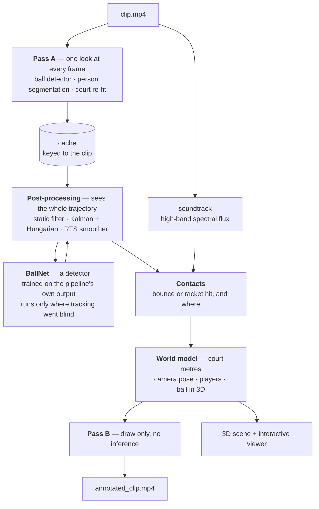

# Tennis Court Tracking — ball trajectory, court zones, and bounce lighting

Takes a broadcast tennis video and, using nothing but the picture and the soundtrack,
works out where the court is, where the players are standing, where the ball is in three
dimensions, and which zone of the court it touches down in — then lights that zone up.

Everything is in one notebook: [`notebooks/tennis_detection.ipynb`](notebooks/tennis_detection.ipynb).

There is no court-keypoint model and no calibration file. The court is found from its own
painted lines, and the camera's position is recovered from the court.

## Results on the sample clip

22 seconds of ATP hard-court singles, 1920×1080 at 60fps.

| | |
|---|---|
| Court overlay accuracy | **0.21px** from the real paint (median), moving 0.16px/frame |
| Court found | 1325 / 1325 frames, re-fitted independently on every one |
| Ball located | 1203 / 1325 frames (91%), **1094 of them on a real detection** |
| Contacts found | 29 — **18 ground bounces** and 11 racket hits |
| Flashes verified | **18 / 18** checked frame by frame, a visible ball in every one |
| Players located | exactly 2 on every frame, measured **1.55–2.13m** tall (median 1.76m) |
| Camera recovered | 7.8m up, 20.9m behind the baseline, 0.08m off the centre line |
| Render time | 1325 frames in ~70s, no inference in that pass |

## How the pipeline is put together



The split into two passes is what makes iteration bearable — the expensive pass is cached,
so changing a colour or a threshold costs seconds rather than minutes — and it is also what
lets the analysis look at the **whole** trajectory at once, including frames that come
later. A backward smoothing pass and a ball-flight model both need that.

## Using it

Put your video at `data/clip.mp4` and run the notebook top to bottom. The download step
is disabled — the notebook reads your file directly.

```bash
brew install ffmpeg                 # system dependency (provides ffmpeg + ffprobe)
python3 -m venv .venv && source .venv/bin/activate
pip install -r requirements.txt
python -m ipykernel install --user --name=tennis-cv --display-name="Tennis CV (.venv)"
```

> If you hit `FileNotFoundError: 'ffprobe'` even though ffmpeg works in your terminal: a
> Jupyter kernel started from a GUI app doesn't read your shell profile. The first cell
> repairs this automatically — just **restart the kernel** after installing ffmpeg.

**The slow part is cached.** The first run does one YOLO pass over every frame (~3 min
for a 30s HD clip) and saves the result to `data/cache/`. Changing a colour, a line
thickness or a threshold only re-runs the drawing pass — about 50 seconds.

## How it works

Every design decision below exists because something simpler was built first and
**measured** to fail. Where that happened, the numbers are in the text — they are the
reason the code looks the way it does, and they are the first thing to re-check if the
footage ever changes.

### Following the camera

The court is **re-detected on every frame**, so the overlay follows a camera that pans,
zooms or cuts. Each frame's four corners are fitted from scratch against that frame's own
line pixels; nothing is copied from a one-off calibration.

That is a reversal of how earlier versions worked, and the reason is worth stating.
Re-fitting per frame used to be unusable — the old four-edge fit swung a corner over a
68px range, and smoothing it left the overlay lagging behind. The nine-line fit described
below is simply a much better estimator: its drawn lines wobble **0.28px** (median),
**0.71px** (p90).

Three things keep it steady:

- **Two seeds, best fit wins.** Each frame is fitted twice, once starting from the fixed
  calibration and once from the previous accepted frame, and whichever ends up closer to
  the paint is kept. On a synthetic pan-and-zoom, the calibration seed alone left the
  overlay 6.27px off with 609 of 720 frames failing; adding the previous fit gave
  **0.40px and 9 frames**. Propagating the previous fit *alone* is a known way to
  diverge; it is safe here only because it has to win on measured distance to the paint.
- **A centred median** over the fitted corners. Centred matters: it removes the odd bad
  frame with **zero lag**, which a running average cannot do. This is only possible
  because the pipeline is offline and sees the whole clip.
- **Rejection.** A frame whose fit does not sit on the paint is discarded and filled in
  from its neighbours. On this clip nothing needs it any more — every one of the 1325
  fits is accepted — but it is what stops one bad frame propagating.

On static footage the result is an overlay that moves **0.16px per frame** while sitting
**0.21px** from the real paint (worst frame: 0.39px).

### Finding the court

No colour assumptions and no trained model — just image processing plus the court's
known geometry. Every step exists because a simpler one was tried and measurably failed
on real broadcast footage:

| Simpler idea | Why it fails |
|---|---|
| Threshold the blue court surface | The surround apron is teal too — the mask covers 70–90% of the frame |
| Threshold bright white pixels | The far half of the court is in shadow; its lines are never found |
| Take the outermost detected lines | Grabs the advertising boards above the court as the "far baseline" |
| Score a court template against the paint | Prefers the near **half** court (baseline→net), which also fits well |
| Use the net as a reference line | The net tape sits ~1.07m **above** the ground, so it doesn't project like a court line |

What works is **projective invariance**. The four painted cross-court lines always have
the same cross-ratio under any camera view — for a tennis court, **1.0989** (and
**1.1665** down-court). Searching for the line set with that signature identifies the
court regardless of camera, venue or colour. On this footage it matched to within 0.08%.

Lines are found by local **contrast** (a line is brighter than the surface a few pixels
to either side) rather than absolute brightness, so shadowed lines still register.

The full detector runs on sampled frames and the results are combined into one
**consensus** court — per-frame detection alone jumped around by up to ~100px.

### Fitting all nine lines, not just the outer four

The consensus is still only a fit of the court's **outer rectangle**. Nothing constrains
an edge whose evidence is weak, so it can be badly wrong while the fit still looks
self-consistent: measured on this clip, the near-left corner came out **80px** from the
real corner while every other line sat exactly on the paint. On screen that is a doubled
line down the near-left side.

The fix is a final global refit. The camera is static, so a **temporal median of the
court frames** gives a clean plate with the players and the ball averaged away and only
the paint left. The four corners are then optimised so that all **nine** template lines —
baselines, both sidelines, both singles lines, both service lines and the centre line —
land on paint, scored against a distance transform of the clean plate. The service and
singles lines act as the extra constraints that pin down the weak corner.

| | median | mean | p90 |
|---|---|---|---|
| outer-rectangle fit alone | 2.12px | 6.79px | 21.68px |
| **+ global nine-line refit** | **0.00px** | **0.23px** | **0.59px** |

The refit is rejected if it moves a corner more than 60px or fails to improve on the
consensus, so a bad optimisation cannot make things worse than the seed.

### Knowing when the camera is showing the court

The same fit returns a **match score**: how much of the court template lands on real
line pixels. Measured on this clip, court frames score **0.48–0.99** and close-ups
**0.00–0.23**, so a 0.35 threshold separates them cleanly. Corner positions alone cannot
— a close-up sometimes produces corners within 23px of the calibration by chance, which
is exactly how close-ups were previously getting court lines drawn across the crowd.

### Tracking the ball

YOLO detects candidates; a Kalman filter predicts where the ball should go; Hungarian
matching decides which detection is really it; an **RTS smoother** then makes a backward
pass, which is what bridges gaps that a forward-only filter could only drift through.

Whether a candidate is accepted is a **chi-square test on the filter's own predicted
covariance**, not a fixed pixel radius. This matters because a player hides the ball for
about 18 frames during a swing: a fixed radius rejects the ball when it reappears and the
track dies at every stroke, while this gate opens exactly as wide as the prediction is
genuinely uncertain and closes again once the track is clean.

| gate | track fragments | frames tracked |
|---|---|---|
| fixed radius | 8 | 911 (69%) |
| **chi² ≤ 9.21 (99%, 2 dof)** | **3** | **1198 (90%)** |

**What limits this is association, not detection.** At a low confidence threshold the
detector puts a real candidate in essentially every frame — 360 of 360 in the stretch
where tracking currently collapses, against 241 of 360 at the shipped threshold. The
tracker only converts 831 of them into placed detections. Lowering the threshold does not
help on its own (at 0.05 it is *worse*: extra candidates confuse the association), and a
whole-clip global association was built and **rejected** — it placed more frames and
agreed with confident detections more often, but four of its fourteen bounces had no ball
in the frame at all, because it settled onto a static artifact. A stationary point looks
perfectly smooth to any velocity- or acceleration-based cost, which is the flaw in that
whole family of approaches here.

Two filters remove false positives. Detections that keep reappearing within a few pixels
across many *different* frames cannot be a moving ball — measured by radius, not on a
grid, because these artifacts smear across cell boundaries and each cell then falls under
a per-cell threshold. Tracks that never move are discarded outright.

Detection settings were measured on this clip rather than assumed:

| config | frames with the ball | time (600 frames) |
|---|---|---|
| imgsz 960 | 91.3% @ conf 0.20 | 26s |
| **imgsz 1280** | **99.0% @ conf 0.20** | **47s** |
| imgsz 1280 + test-time augmentation | 99.5% | 90s |

At HD the ball is ~3× bigger than at 360p, so recall is no longer the bottleneck — hence
a *higher* confidence threshold, which cuts false positives at almost no cost.

### Telling a bounce from a racket hit

Both look identical in the image: the ball reverses vertically. Finding the reversal is
the easy half — the hard half is knowing what caused it.

**An earlier version got this exactly backwards, and it is worth explaining why.** It
compared outgoing to incoming vertical speed, on the reasoning that a bounce can only
*lose* energy while a racket adds it. That ratio does separate this clip's contacts
cleanly — but into *near court* and *far court*, not into bounces and hits. Perspective
compresses the outgoing speed of any near-court contact (ratios 0.08–0.28) and expands it
for any far-court one (2.4–8.7). Every racket hit at the near baseline was therefore
labelled a bounce, and every real bounce in the far court was thrown away.

What replaces it is direct evidence: **was a player there?** The person masks are already
being computed for drawing, so the distance from the ball to the nearest silhouette is
free. Dividing it by **that player's own pixel height** turns pixels into metres at that
player's depth, which makes one threshold work for the near player and the far one alike
— and, crucially, needs no estimate of the ball's height. Measured over contacts labelled
by eye from the footage:

| | n | min | median | max |
|---|---|---|---|---|
| racket hits | 8 | 0.00 | 0.25 | 0.34 |
| ground bounces | 7 | 0.18 | 0.59 | 0.82 |
| not a contact (net crossings) | 6 | 0.33 | 1.05 | 1.87 |

A racket meets the ball at hand height and never below the player's feet, so a second
test — the ball must be at or above the silhouette's foot line — resolves the one
overlapping case, where a far player happened to stand directly above a bounce.

Two supporting details. Speed is ~0 *at* the reversal by definition, so the peak speed
either side of it is measured, never the value at the crossing. And reversals are read
only from **runs where the ball was actually seen**: the track now coasts through
occlusions, and running a derivative across a coasted gap invents reversals that never
happened (9 of 25 candidates, before this was fenced off).

**But proximity is measured in pixels, and pixels hide depth.** At 9.08s the ball bounces
in the near backcourt at (3.3, 3.0)m while the player stands at about (5, −1)m — four
metres apart on the court, and yet the ball's image position lands squarely on his body, so
the test reports a gap of 0.00 and calls a bounce a hit. Measuring the same thing in court
metres does not help, because the ground projection of a ball in the air is itself wrong by
metres.

What does separate them is a signal that never involves height at all: **a racket sends the
ball back the way it came, and a bounce lets it carry on.** Over the labelled contacts, 4 of
10 racket hits reverse the ball's horizontal travel and only 1 of 11 bounces does. That is
too weak to classify on its own — plenty of shots go straight down the line — but it is
decisive for the case that was actually breaking: a bounce and the return that follows it,
0.27s apart, arriving as one cluster. The crossing that turns the ball is the racket; the
one that does not is the bounce before it, and both are kept.

**How we know when one is still missing.** A rally alternates hit → bounce → hit, so two
contacts of the same kind in a row mean one between them was missed. The pipeline checks
that on every run and prints the count. It is a far better instrument than watching the
video for a flash that never comes.

### The bounces that don't look like bounces

Finding a reversal assumes the ball visibly turns round on screen. Near the camera it often
doesn't. A ball bouncing by the near baseline is still travelling *towards* the lens, so it
carries on down the picture even as it climbs, and the reversal never happens — at 11.66s
the ball's descent rate collapses from **8.9 to 1.0 px/frame** across the bounce with no
change of sign at all. It is plainly a bounce on the frames. It was invisible.

The contact is still there in the numbers, as an **impulse**: something arrested the ball.
Rather than rebuild the detector around that — which was tried, and moved verified bounces
around at every threshold — the pipeline asks two questions afterwards that only physics can
answer:

- **can a player hit the ball twice in a row?** No. So two consecutive racket hits on the
  same side of the net mean the first one was the bounce he hit it after.
- **can the ball reach a racket without touching down?** Only if it was volleyed. So
  wherever a hit has no bounce before it, go and look for the impulse — and if the ball was
  never tracked well enough to show one, fall back to the flight arcs either side.

That took the missing-bounce count from **6 to 1** and the flashes from 11 to **18**, all of
them verified frame by frame against the footage. The one that remains is a stretch where
the ball is genuinely visible on 4 frames out of 83.

Recovering the ball's true 3D height would be the principled way to do this, and it was
tried. It does not work from one camera at this elevation — height and depth are near
degenerate at 13°, and both a full ballistic fit and a constrained two-parameter version
returned heights of 14m, 21m and −6m. Judging direction from the ball's apparent court
position fails for the same reason: that position is wrong by metres whenever the ball is
in the air.

### A detector taught by the pipeline itself

The general-purpose ball detector looks at one frame at a time, and that is why it fails
where it matters. In the stretches where tracking collapses, dropping it to a very low
confidence and removing every known artifact still turns up a plausible candidate on only
28–40% of the untracked frames; one stretch has the ball genuinely visible to it on **1
frame in 62**. No threshold rescues that.

So the pipeline trains its own. `BallNet` is a small heatmap network that is handed **three
consecutive frames stacked together**, and that input is the whole idea: a painted logo or a
scuff mark looks identical in all three, and a ball never does. The very thing that makes a
static false positive indistinguishable to a single-frame detector is what gives it away
here.

It needs no labelled data. The pipeline has already tracked the ball confidently on hundreds
of frames and has already identified the static artifacts by radius, so it writes its own
positives and its own hard negatives. Training takes about five minutes on a laptop GPU.

Held out on **two contiguous blocks of the clip** — never random frames, since at 60fps
neighbouring frames are near-identical and a random split would flatter it — it finds the
ball on **439 of 444** held-out crops, **434 of them within 12px**, median error **1.0px**.

Run on the frames the first tracking pass left empty, and only inside the corridor the
surrounding track implies, it lifts the number of frames resting on a real detection from
**831 to 1094 of 1325**, and the number of ground bounces from **11 to 15** — the two
physics checks in the next section then take it to 18.

### Hearing what the camera cannot see

The soundtrack is a second, independent channel. A racket hit and a ground bounce are
sharp broadband transients, and high-band spectral flux finds **28 impacts in 22 seconds**
— 8 of which line up with a vision contact to within **±0.07s**, which is also what
confirms the audio and video are in sync.

Audio says *when* a contact happened; the tracked ball still says *where*. That division
matters: an impact with no ball tracked near it is not turned into a flash. Most impacts
the camera misses turn out to be racket hits rather than bounces, so this is not free
recall — measured, it takes ground bounces from 8 to 11.

### The net hides most of the far service box

This is the reason the service boxes never used to light up, and it is geometry rather
than a detector weakness. The camera sits 7.8m up and 21m behind the baseline. Follow its
line of sight to a point on the far court and ask how high that ray is when it crosses the
net: if it is under about a metre, the ray goes through the netting. That covers the court
from the net out to roughly 16–17m — **most of the 6.4m far service box.**

The measurements agree: 17 ball detections in the image rows covering that band, against
305 and 169 in the bands just above it; 255 detections in the far backcourt against 35 and
12 in the two far service boxes. A colour-and-motion detector aimed at the band was tried
and returns 5–11 blobs of static clutter per frame.

So the world model reconstructs those bounces instead: audio fixes the moment, the ball is
tracked going in and coming out, and a ballistic arc with height zero at the impact fixes
where it landed. Reconstructed bounces are lit more softly than observed ones, so you can
always tell which is which. The near service box is in front of the net and needs none of
this.

### The minimap, and why the ball's position needs correcting

The homography maps the **ground**. Applied to a ball in mid-air it reports where the
camera's line of sight hits the ground, which is several metres from the ball. Camera
position is recovered from the homography itself (on this clip: 7.8m up, 20.9m behind the
baseline, and 9cm off the centre line — where broadcast cameras actually sit, which is a
useful sanity check). Between two known contacts the ball flies a parabola whose
curvature is gravity and whose endpoints are the two contact heights, so each point can
be slid back along the camera ray to where the ball really is.

At a ground bounce no correction is needed at all: the ball is *on* the ground, so the
homography gives its court position exactly. That is the one moment the projection is
trustworthy, and it is the moment the zone flash uses.

This is only as good as the contact detection feeding it, so the correction is bounded:
skipped on long gaps, height clamped, and discarded entirely if it would move the ball
more than 5m. The clamp is not cosmetic — of 40 one-sided arc fits, 16 peak above 2m and
some reach 9m, and the plausible-height band is what throws those away.

Where only one contact is within reach, the arc is fitted to the picture and run outwards
for a fraction of a second before its free end starts to drift. Where neither is, the ball
keeps its raw ground projection and is **labelled unknown and drawn faded**, because that
dot is a direction, not a position. On this clip: 829 frames anchored between two contacts,
156 extrapolated from one, 218 unknown.

### How much of this is real, and how much is a story

Enough to be worth stating plainly, with numbers from a simulation using this clip's own
camera and a ball carrying realistic drag and topspin:

| how the ball is placed | error, flat drive | error, heavy topspin |
|---|---|---|
| homography only, height ignored | **5.81m** median, 7.71m worst | **8.87m** median, 12.26m worst |
| the parabola between two contacts | **0.60m** | **2.04m** |

That is why the height model exists. It is also why nothing here tries to *measure* height
from the images. With the camera 13° above the court, raising the ball and pushing it
further away move it along image directions **0.8° apart** — a free ballistic fit
reproduces the picture to **1 pixel** while putting the ball **1.4–1.9m wrong in height**
and up to 5.7m wrong in where it lands. A low reprojection error proves nothing here, so
every arc in the pipeline is anchored at a height that is already known: zero at a bounce,
hand height at a racket contact.

### Seeing it in three dimensions

The notebook keeps a full 3D description of the scene — court, net with its real sag,
players standing at their measured heights, ball with a height and a label saying how well
that height is known — and can render it from any viewpoint. Nothing about the annotated
video changes; this is for inspecting what the pipeline believes.

The most useful viewpoint is behind the far baseline looking back over the net, because the
band of court the camera cannot see through the netting is shaded on the floor and the far
service box is plainly sitting inside it.

The same model is also **live and turnable inside the notebook** — orbit it, scrub the
rally, click any bounce to jump to it. It is written to `data/outputs/rally3d.html` as well,
which opens on its own with no network and no libraries.

A quiet sanity check falls out of it for free: the players' heights, recovered from their
own geometry, come out **1.53–2.12m, median 1.76m**. If that number ever drifts, the camera
solve is wrong.

### Scaling

Every threshold is expressed through `px()`, `nframes()` or `speed()`, derived from the
clip's own resolution and frame rate. Swapping footage cannot silently mistune the
pipeline — which matters, because the same numbers that worked at 640×360/25fps are all
wrong at 1920×1080/60fps.

## What's drawn

**The lines you see are the detected ones.** Each of the nine court lines is stroked only
where the detector actually found paint underneath it — so a stretch that is occluded, in
deep shadow or out of frame is simply not drawn, instead of a template being painted over
the picture. Short gaps (a few missed samples on scuffed paint) are bridged so a line
that is plainly there does not come out dashed; a genuinely absent stretch stays absent.

They are thin and a **muted yellow**. The tap flash is the same hue at full brightness, so
when a zone lights up it still dominates the frame rather than blending into the lines.

When the ball touches the court, **that zone lights up and fades** — nothing else, no ring
or marker or label. It holds at full strength briefly before fading, so a flash is hard to
miss. A ball landing just past a line is a line call rather than a stray ball, so it
lights the zone it missed (up to 1.5m); anything further out lights nothing.

A dot marks each point where two painted lines cross — and, like the lines, only where the
paint under both of them was actually found.

Each player gets a **thin green box**, no label and no fill — and there are always exactly
two of them, because singles guarantees **one player on each side of the net**. That
constraint does what no threshold could: filtering by position alone still boxed a line
judge seated beside the net post on 94 frames, and occasionally boxed one player twice.
Taking the best candidate per side — scored on plausible height, being on the court rather
than out beside it, and being where that side's player was a moment ago — leaves two boxes
on every frame of the clip.

The ball has a light blended trail, and a small minimap sits bottom-right.

**The minimap is a view of a world model, not a redrawing of the picture.** The pipeline
keeps an explicit description of the scene in court metres — where the camera is, where
each player is standing, and where the ball is in three dimensions — and the minimap
renders that. It is oriented to match the camera (near court at the bottom, left on the
left) and covers a couple of metres of run-off past each baseline, because that is where
players actually stand. When a zone lights up on the court it lights up on the minimap
too.

Player positions are the one part of the scene that can be placed exactly: their feet are
on the ground, so the court mapping applies to them with no height ambiguity at all. The
ball is the hard case — see below.

**Players are drawn in front of the lines.** A second small model (`yolo11n-seg`)
segments people, and the court graphics are composited only where there is no player, so
the lines and the lit zone pass behind them instead of being painted across their
bodies. Bounding boxes would punch rectangular holes, which is why this uses
segmentation. The same masks are what the bounce/hit test reads — they are the only part
of the analysis that model feeds.

## Limitations

- **Some bounces are still missed, and the pipeline says how many.** A rally alternates hit
  → bounce → hit, so counting same-kind neighbours gives an honest score without anyone
  watching the video: **3 stretches still have a bounce missing**, down from 6. In the worst
  of them the ball is genuinely visible on 4 frames out of 83. On the current 22s clip the
  pipeline reports 29 contacts — 18 ground bounces and 11 racket hits — and every flash was
  checked frame by frame against the footage, with a visible ball in all 18.
- **The far service box still does not flash on this clip.** The reconstruction machinery
  for net-occluded bounces is in place and guarded, but on this footage nothing clears the
  bar, so it fires zero times. Every one of the 18 flashes is a bounce actually observed —
  none is inferred. The near service box does flash.

  This is worth spelling out, because a weaker version of the test *did* fire. Fitting the
  ball's arc on each side of a candidate moment and checking that the two halves agree on
  where it touched down looks convincing, and it produced five bounces behind the net that
  agreed to within 0.04–0.72m. Pulling the frames showed all five were the ball simply
  **crossing the net** — which makes sense in hindsight: where nothing happens, the two
  halves are fitting the same uninterrupted flight, so of course they agree. Agreement is
  not evidence of a contact. What is: the ball has to be *turned round*, arriving with
  downward vertical speed and leaving with upward. All five candidates fail that test, and
  8 of the 11 bounces the camera saw for itself pass it.
- **The bounce/hit test is evidence about players, not about the ball.** It asks whether
  a player was at the contact, which is reliable here but would misfire in situations
  the clip does not contain: a ball bouncing at a player's own feet, or a player
  standing directly on top of a far-court bounce in the image (the foot-line test covers
  the one such case here, but it is a heuristic, not a proof).
- **Ball height is modelled, not measured**, and cannot be otherwise from this camera. A
  gravity-only fit to a ball with realistic drag and topspin matches the picture to 1 pixel
  while being 1.4–1.9m wrong in height; adding a drag parameter does not rescue it. So the
  height comes from contact anchors and gravity, which holds between two contacts and
  degrades whenever one is missed. It reaches 985 of 1203 tracked frames; the other 218 keep
  the raw ground projection and are labelled unknown rather than dressed up.
- **The ball's apparent size was tried as a depth cue and rejected.** A tennis ball is
  67mm, so its width in pixels ought to say how far away it is, and that is the one
  measurement that could separate height from depth. Measured against bounces, where the
  distance is known exactly: the detector's boxes come out **2.4× too big** — they are
  measuring motion blur, not the ball — and the distance they imply is **4.3m out** against
  a 3m bar. The correlation is real (+0.77) but far too weak to use.
- **Camera position is estimated, not measured** — from the homography, assuming square
  pixels and a centred lens. If the solve degenerates the correction is skipped.
- **Overlays only appear on wide court shots**; close-ups and replays are suppressed.
  This clip contains none, so the close-up rejection is not exercised end to end here.
- **Camera tracking was verified on a synthetic pan-and-zoom**, not on real moving
  footage. It holds to 0.40px through moderate motion; at the extreme end of that test
  (1.45× zoom, most of the court cropped away) coverage of the drawn lines falls off.
  A real cut to a different camera position has not been tested at all.
- **The ball model is a small community checkpoint** (self-reported ~92% mAP@50).
- **The learned detector is trained on this clip, by this clip.** That is what makes it
  free of hand-labelling, and it is also its ceiling: it has learned this court, this
  lighting and this ball, and nothing says it transfers to other footage. It also inherits
  whatever the tracker got wrong, since the tracker wrote its labels. On new footage it
  should be retrained, which costs about five minutes — delete
  `models/ball_heatmap_*.pt` and the matching cache.
- **Players are segmented for drawing and for the contact test**, but there is no player
  tracking, identification or stroke classification. The two-player rule assumes **singles**
  — it would need replacing for doubles.
- A "YOLO pose" court-keypoint model was considered and deliberately not adopted: no
  genuine pretrained checkpoint exists for tennis court keypoints — that class of demo
  actually uses a non-YOLO ResNet/heatmap network hosted unofficially.
